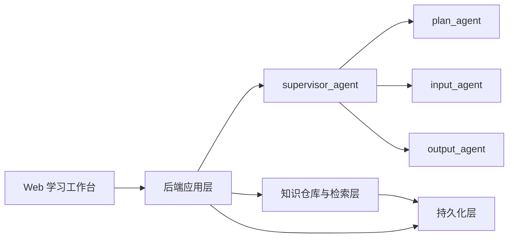
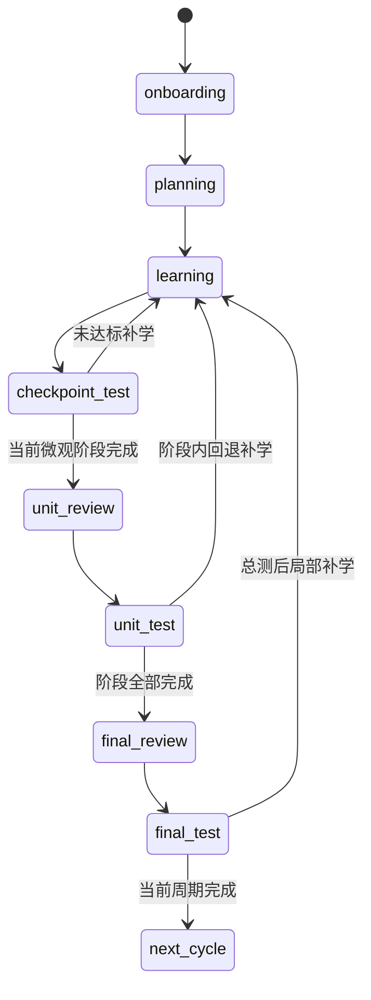
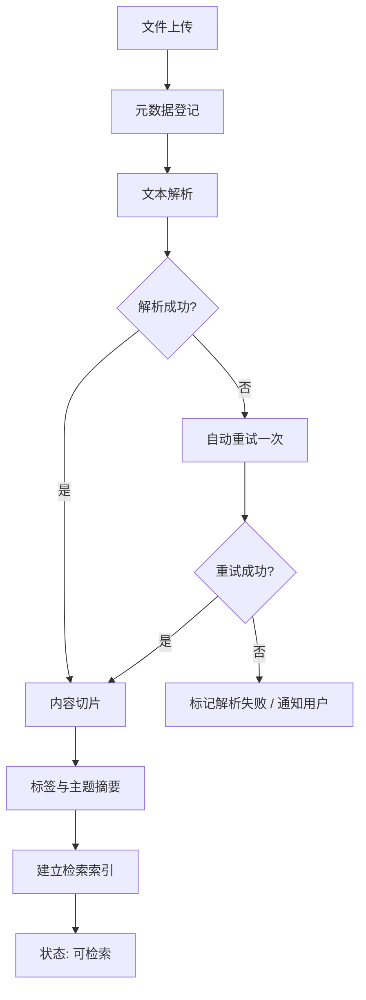

# StudyPilot V1 规格实现文档

## 1. 文档目标

本文档用于把 StudyPilot V1 落实为可直接进入工程实现的方案，覆盖系统边界、核心模块、Agent 编排、状态流转、数据模型、接口定义和实施建议。

本文档聚焦“系统必须如何工作”。详细技术选型、取舍理由和可替换边界请参考 `tech-stack.md`。

本文档以以下约束为前提:

- 产品形态: Web 应用
- 用户范围: 单用户 MVP
- 学科范围: 通用学科框架
- 知识仓库: 本地上传为主
- Agent 架构: `supervisor_agent` 自动调度 `plan_agent`、`input_agent`、`output_agent`

### 1.2 当前仓库同步状态

- 同步日期: `2026-03-31`
- 本文档中的系统设计已完成**阶段 1 后端内核最小闭环**、**阶段 2 前端正式工程对接**与**阶段 3 纵向联调闭环**，当前仓库已存在正式前后端目录、OpenAPI 契约快照、数据库迁移和真实服务化 API。
- 当前实现以 **OpenAPI 契约** 为唯一事实源，实际契约文件位于 `packages/contracts/openapi.json`。
- 当前实现已经落地的接口分组:
  - `/api/profile`
  - `/api/knowledge`
  - `/api/plans`
  - `/api/learning/session`
  - `/api/assessments`
  - `/api/workflow`
- 当前实现已经落地的阶段 2 能力:
  - 首页已按 `workflow + profile + current plan` 展示下一步动作入口
  - `/profile` 已支持最小建档与更新
  - `/knowledge` 已支持上传、列表、删除与失败重试
  - `/plans` 已支持基于档案与 ready 资料生成当前计划
  - `/workbench` 已支持启动学习、发送问题、提交完成信号
  - `/assessments` 已支持生成测试、恢复题面、提交答案与展示评分结果
- 当前实现已经落地的阶段 3 能力:
  - 已新增 happy path / fallback path 浏览器 E2E，覆盖阶段三固定业务切片
  - 已补齐 workflow 历史、`recent_assessment_id` 与当前计划指针的一致性自动化断言
  - 当前测试页已验证在刷新后恢复待答题题面，并在提交后恢复评分结果
- 当前实现已经落地的阶段 1 能力:
  - 已接入 `supervisor -> plan_agent / input_agent / output_agent` 的最小工作流编排
  - 已接入 `LLMProviderAdapter`、`RetrievalProvider`、`KnowledgeParser`、`ChunkingService`、`ScoringService`
  - 已实现 `.md`、`.txt`、文本型 `.pdf` 的真实解析、切片、索引和混合检索
  - 已实现测试评分、工作流回退与 `AgentTask` / `AgentDecision` 审计记录
- 当前实现仍保留的阶段性限制:
  - 默认启用 fake provider，真实外部 LLM 作为可切换能力而非默认路径
  - 文件处理仍为同步执行，未接入后台异步 worker
  - 学习接口仍为普通请求响应，尚未扩展为流式会话接口
  - 学习会话当前不支持刷新恢复，刷新后会重新发起新会话
- 当前代码契约统一采用 `snake_case` 字段命名；如本文中存在概念性 camelCase 写法，应以 OpenAPI 实际字段为准

### 1.1 技术栈总览

V1 推荐采用以下技术组合:

- 前端: `Next.js App Router + React + TypeScript + Tailwind CSS + TanStack Query`
- 后端: `Python + FastAPI + Pydantic + SQLAlchemy`
- 数据库: `PostgreSQL + jsonb + pgvector`
- Agent 编排: `LangGraph`
- 模型接入: `OpenAI 风格接口 + LLMProviderAdapter`
- 检索层: 统一 `RetrievalProvider`

以上内容仅作为实现总览。详细理由、备选方案和替换边界请参考 `tech-stack.md`。

## 2. 系统总体架构

### 2.1 架构目标

V1 采用单体后端加 Agent 编排的架构，以尽快打通完整学习闭环，并减少早期系统复杂度。

### 2.2 逻辑分层

1. 前端 Web 层
   - 提供左侧全局独立导航（全局计划、工作台、仓库、测试记录）
   - 提供沉浸式“左图文+右对话”的双栏学习工作台交互
   - 提供对话中快捷资料上传入口
   - 展示计划、学习内容、测试题（支持“我不确定”选项）、评分结果和历史记录

2. 后端应用层
   - 管理用户状态、学习流程和业务规则
   - 提供计划、学习、测试、侧边栏独立对话、资料管理等接口
   - 负责任务编排、持久化和日志记录

3. Agent 编排层
   - 由 `supervisor_agent` 负责识别阶段并派发子任务
   - 子 Agent 根据当前状态完成计划、讲解或测试能力

4. 知识处理与检索层
   - 负责资料上传、解析、切片、标签和检索
   - 为计划、学习、出题三个模块提供统一上下文

5. 持久化层
   - 保存用户画像、资料元数据、计划、学习记录、测试结果、偏好快照和 Agent 决策日志

### 2.3 参考架构图

## 3. Agent 架构与职责

## 3.1 supervisor_agent

职责:

- 读取当前用户阶段、计划进度、学习完成度和最近测试结果
- 判断当前应进入计划、学习、测试或补学环节
- 生成并下发子 Agent 任务
- 接收子 Agent 结果并更新系统状态

输入:

- 用户当前状态
- 当前计划节点
- 学习会话摘要
- 最近测试记录
- 用户偏好画像

输出:

- `AgentTask`
- `AgentDecision`
- 阶段切换结果

## 3.2 plan_agent

职责:

- 基于用户目标、基础、时间预算和知识仓库资料生成宏观计划
- 将当前阶段拆解为可执行的微观计划
- 根据测试结果和进度对计划进行动态调整

输入:

- `UserProfile`
- `KnowledgeAsset` 检索结果
- 历史计划
- 学习进度和评估结果

输出:

- `MacroPlan`
- `MicroPlan`
- 计划调整建议

## 3.3 input_agent

职责:

- 基于当前微观计划生成结构化学习内容
- 根据用户提问进行连续讲解和追问应答
- 根据偏好调整讲解方式、示例密度、术语解释和信息组织方式

输入:

- `MicroPlan`
- `UserProfile`
- 当前知识检索结果
- 当前 `LearningSession`

输出:

- 学习讲义内容
- 互动式答疑内容
- 学习阶段摘要
- 对掌握度的初步判断信号

## 3.4 output_agent

职责:

- 在合适时机生成小节测试、单元测试和总测试
- 对答案进行评分、讲评和错误归因
- 根据结果提出补学建议和后续行动建议

输入:

- 当前或最近学习内容
- `MicroPlan` 或阶段计划
- 用户偏好
- 历史错题与最近表现

输出:

- `Assessment`
- `Evaluation`
- 补学建议
- 难度调整建议

## 4. 学习状态机

V1 需要一个显式状态机来支撑 Agent 自动调度和流程可追踪。

### 4.1 状态定义

- `onboarding`: 建立用户档案和偏好
- `planning`: 生成或调整宏观/微观计划
- `learning`: 进行当前微观计划对应的学习
- `checkpoint_test`: 执行小节测试
- `unit_review`: 阶段复盘与补强
- `unit_test`: 阶段性单元测试
- `final_review`: 总复习
- `final_test`: 总测试
- `next_cycle`: 进入下一轮计划周期

### 4.2 核心状态流转

### 4.3 状态切换原则

- 状态切换由 `supervisor_agent` 主导，不由用户显式选择。
- 任何测试未达到预设阈值时，允许回退到对应的补学状态。
- 阶段切换必须被持久记录，便于解释系统决策。

## 5. 领域模型

以下模型是 V1 必须明确的核心对象。

## 5.1 UserProfile

用于保存用户学习画像。

关键字段:

- `id`
- `learningGoals`
- `subjectScope`
- `currentLevel`
- `timeBudget`
- `preferredStyle`
- `preferredDifficulty`
- `preferredQuestionTypes`
- `behaviorSummary`
- `updatedAt`

说明:

- `preferredStyle` 存放显式偏好，如严谨型、轻松型、案例型。
- `behaviorSummary` 存放从对话和测试中提炼出的隐式偏好。

## 5.2 KnowledgeAsset

用于表示上传进入知识仓库的资料。

关键字段:

- `id`
- `title`
- `sourceType`
- `fileType`（`.pdf`、`.md`、`.txt` 等）
- `fileSizeBytes`
- `status`（`uploading` / `parsing` / `indexing` / `ready` / `parse_failed`）
- `parseErrorReason`（仅 `parse_failed` 时填充）
- `retryCount`（自动重试次数，上限 1）
- `rawPath`
- `parsedText`
- `tags`
- `chunks`
- `createdAt`
- `deletedAt`（软删除时间戳，为 null 表示未删除）

说明:

- `status` 生命周期：`uploading → parsing → indexing → ready`，失败分支 `→ parse_failed`。
- `parseErrorReason` 枚举值：`UNSUPPORTED_FORMAT`、`FILE_CORRUPTED`、`EMPTY_CONTENT`。
- `retryCount` 达到上限（1）后不再自动重试，但允许用户手动触发。
- `chunks` 为对外返回的切片摘要；当前实现内部已使用独立 `knowledge_chunks` 持久化表保存切片内容、embedding 和元数据。
- 支持软删除：`deletedAt` 不为 null 时，Agent 检索跳过该资料，历史引用标记为 `[已删除]`。

## 5.3 MacroPlan

用于表示一个学习周期的总计划。

关键字段:

- `id`
- `userId`
- `title`
- `goal`
- `duration`
- `milestones`
- `units`
- `status`
- `version`
- `createdAt`

说明:

- `units` 表示阶段性学习模块。
- `version` 用于保留计划历史。

## 5.4 MicroPlan

用于表示具体执行层面的学习安排。

关键字段:

- `id`
- `macroPlanId`
- `unitId`
- `title`
- `topics`
- `estimatedDuration`
- `tasks`
- `completionCriteria`
- `assessmentTrigger`
- `status`

说明:

- `tasks` 需要足够细，以便直接驱动学习和测试。
- `assessmentTrigger` 定义何时进入小节测试。

## 5.5 LearningSession

用于保存一次学习会话的上下文。

关键字段:

- `id`
- `microPlanId`
- `sessionSummary`
- `conversationTurns`
- `completionSignals`
- `masterySignals`
- `startedAt`
- `endedAt`

说明:

- `completionSignals` 可记录用户确认学完、时间达到、章节覆盖等信号。
- `masterySignals` 可记录答疑表现、用户自评、系统判断摘要。

## 5.6 Assessment 与相关对象

### Assessment

- `id`
- `type`
- `scope`
- `linkedPlanId`
- `questions`
- `difficulty`
- `status`

### Question

- `id`
- `assessmentId`
- `questionType`
- `stem`
- `options`
- `referenceScope`
- `expectedCompetency`

### Submission

- `id`
- `assessmentId`
- `answers`
- `uncertainties`（记录用户选择“我不确定”的题目集合，用于精准判断盲区）
- `submittedAt`

### Evaluation

- `id`
- `submissionId`
- `score`
- `feedback`
- `mistakeAnalysis`
- `recommendations`

## 5.7 AgentTask 与 AgentDecision

### AgentTask

- `id`
- `targetAgent`
- `taskType`
- `inputContext`
- `triggerReason`
- `createdAt`

### AgentDecision

- `id`
- `taskId`
- `decisionSummary`
- `nextState`
- `artifacts`
- `createdAt`

## 6. 个性化机制

V1 个性化采用显式偏好和隐式行为总结双通道。

### 6.1 显式偏好

来源:

- 用户首次建档填写
- 用户在对话中直接提出的要求

内容:

- 讲解风格
- 难度偏好
- 题型偏好
- 节奏偏好

### 6.2 隐式偏好

来源:

- 用户对不同讲解方式的反馈
- 用户追问类型
- 用户在测试中的得分和错因
- 用户对题目难度的接受情况

### 6.3 应用方式

- `plan_agent` 参考时间偏好、难度承受能力和长期目标来调整计划强度。
- `input_agent` 参考讲解风格和信息密度偏好调整内容组织。
- `output_agent` 参考题型偏好和表现数据调整测试结构和难度。

## 7. 核心业务流程

## 7.1 新用户启动流程

1. 用户填写学习目标、时间预算、基础水平和偏好。
2. 用户上传学习资料。
3. 系统解析资料并建立知识索引。
4. `supervisor_agent` 触发 `plan_agent` 生成宏观计划和首个微观计划。
5. 前端展示当前学习周期与第一阶段任务。

## 7.2 学习流程

1. `supervisor_agent` 判断当前应进入 `learning`。
2. `input_agent` 基于 `MicroPlan` 和知识检索结果生成学习内容。
3. 用户阅读内容并连续提问。
4. 系统记录会话摘要、掌握度信号和完成度信号。
5. 达到微观计划中的测试触发条件后，流转到 `checkpoint_test`。

## 7.3 测试流程

1. `output_agent` 根据近期学习内容和计划范围生成测试。
2. 用户提交答案。
3. 系统进行判分和讲评。
4. `supervisor_agent` 根据结果决定:
   - 回到 `learning` 进行补学
   - 进入 `unit_review`
   - 进入更高层级测试

## 7.4 周期迭代流程

1. 当阶段目标完成后，系统更新阶段状态。
2. `plan_agent` 根据测试结果和历史进度调整后续微观计划。
3. 当宏观计划完成后，系统生成下一周期建议并进入 `next_cycle`。

## 8. 接口设计

V1 接口以后端 REST API 为主，后续可再增加流式会话接口。

## 8.1 资料接口

### `POST /api/knowledge/assets`

用途:

- 上传资料并创建 `KnowledgeAsset`

请求核心字段:

- 文件（multipart/form-data，大小 ≤ 20 MB）
- 标题
- 标签（可选，数组）

响应核心字段:

- `assetId`
- `status`（`uploading` / `parsing` / `indexing` / `ready` / `parse_failed`）

错误响应:

- `400 FILE_TOO_LARGE`: 单文件超出 20 MB
- `400 BATCH_LIMIT_EXCEEDED`: 单次超过 10 个文件
- `400 STORAGE_QUOTA_EXCEEDED`: 总容量超出 500 MB
- `415 UNSUPPORTED_FORMAT`: 文件格式不支持

### `GET /api/knowledge/assets`

用途:

- 查询资料列表与解析状态

响应核心字段:

- `assets[]`: 包含 `assetId`、`title`、`status`、`parseErrorReason`（仅失败时）、`tags`、`createdAt`

### `DELETE /api/knowledge/assets/{assetId}`

用途:

- 删除指定资料（保留引用标记，不影响已生成内容）

### `POST /api/knowledge/assets/{assetId}/retry`

用途:

- 手动触发对解析失败资料的重新解析

### `GET /api/knowledge/search`

用途:

- 基于语义查询检索知识片段（混合检索：向量 + 关键词）

请求核心字段:

- `query`: 查询语句
- `topK`: 返回片段数（默认 5）
- `tags`（可选）: 标签过滤

响应核心字段:

- `chunks[]`: 包含 `assetId`、`chunkId`、`content`、`score`

## 8.2 计划接口

### `POST /api/plans/generate`

用途:

- 生成宏观计划与当前微观计划（支持通过自然语言目标和直接拖拽上传相关资料联合生成）

请求核心字段:

- 用户目标 (文字输入)
- 时间预算
- 当前基础
- 偏好信息
- 附带资料文件列表 (可选，后台自动先走资料上传/解析流程后，再传参给 plan_agent)

响应核心字段:

- `macroPlan`
- `currentMicroPlan`

### `GET /api/plans/current`

用途:

- 获取当前正在执行的宏观计划和微观计划

### `POST /api/plans/{planId}/recalculate`

用途:

- 基于最近表现重新调整计划

## 8.3 学习接口

### `POST /api/learning/session/start`

用途:

- 为当前微观计划开启学习会话

### `POST /api/learning/session/message`

用途:

- 用户发送问题，`input_agent` 返回定制化讲解内容

请求核心字段:

- `sessionId`
- `message`
- 可选风格要求

响应核心字段:

- `reply`
- `sessionSummary`
- `masterySignals`

### `POST /api/learning/session/complete`

用途:

- 标记本次学习环节完成并触发状态评估

## 8.4 测试接口

### `GET /api/assessments/{assessmentId}`

用途:

- 获取已生成测试的题面详情，支持前端刷新后恢复待答题内容

### `POST /api/assessments/generate`

用途:

- 生成当前阶段测试

### `POST /api/assessments/{assessmentId}/submit`

用途:

- 提交答案

### `GET /api/assessments/{assessmentId}/result`

用途:

- 获取评分、讲评、错因分析和下一步建议

## 8.5 调度与状态接口

### `GET /api/workflow/current`

用途:

- 获取当前工作流状态、当前阶段和下一步动作

### `POST /api/workflow/advance`

用途:

- 由后端内部或前端显式触发一次阶段评估与流转

## 9. 知识仓库设计

## 9.1 文件约束规格

| 约束项 | 限制值 |
|--------|--------|
| 单文件大小上限 | 20 MB |
| 单次上传文件数量上限 | 10 个 |
| 单用户总容量上限（V1） | 500 MB |
| 支持格式 | `.pdf`、`.md`、`.txt`，可扩展 |

- 超出大小或数量限制时，后端应在接受文件分片前返回 `400` 并附带明确错误码，不得静默截断。
- 超出总容量时，应拒绝新上传并提示用户清理旧资料。

## 9.2 处理流程

### 解析失败处理规格

- 解析失败资料保留上传记录，状态标记为 `parse_failed`，不进入检索索引。
- 前端应在资料列表中对 `parse_failed` 状态资料显示具体失败原因（格式不支持 / 文件损坏 / 内容为空）。
- 用户可选择删除失败资料或重新上传替换版本。
- 解析失败不影响同一批次其他资料的正常处理流程。

## 9.3 检索策略

V1 采用**混合检索**策略，兼顾语义相关性和关键词精准度：

- **向量检索（主）**: 对切片内容生成 Embedding，使用余弦相似度检索语义相关片段。
- **关键词检索（辅）**: 对主题词、术语等高频词进行精确匹配补充召回。
- **检索结果合并**: 对两路结果进行去重和相关度加权排序，取 Top-K 片段组装上下文。
- **Top-K 范围**: V1 默认 K=5，可根据 Agent 任务类型（计划生成/内容生成/出题）动态调整。
- 当前实现默认使用 fake embedding 保证测试稳定；生产环境可切换为真实 embedding provider。
- 检索模型实现细节（向量模型选型、索引方案）在规格阶段不锁定，由工程实现决定。

## 9.4 资料组织与计划关联

- V1 阶段资料为用户全局共享，不与特定计划或主题绑定。
- 用户可为资料附加自定义标签；Agent 在检索时可将标签作为过滤条件之一。
- 计划生成时，Agent 以当前学习目标关键词为查询，检索相关片段，而非全量加载。
- 资料删除后：
  - 已生成的计划内容和学习记录**不受影响**。
  - 后续 Agent 检索**不再引用**已删除资料的片段。
  - 若已删除资料曾被某个 `MicroPlan` 引用，该引用字段标记为 `[已删除]`，不影响计划执行。
- 当知识仓库为空时，`plan_agent` 应仅凭用户目标和档案信息生成通用计划，并在计划摘要中提示用户上传资料可显著提升计划质量。

## 9.5 使用原则

- 计划生成时优先参考上传资料的主题覆盖范围。
- 学习生成时优先引用当前微观计划相关资料片段。
- 测试生成时优先围绕已学习范围和资料上下文出题。

## 10. 评分与测试策略

## 10.1 题型建议

V1 可先支持以下题型:

- 单选题
- 多选题
- 判断题
- 简答题/填空题（带“我不确定”跳过机制）
- 结合资料的解释题

## 10.2 评分策略

- 客观题使用规则判分。
- 主观题使用 LLM 评分加结构化评语输出。
- 评分结果必须包含得分、错因、知识点映射和建议补学方向。
- 当前阶段 1 已实现“客观题规则判分 + 主观题 provider 评分”的最小可用版本。

## 10.3 难度控制

- 默认以中等难度为主。
- 最近测试连续过高时可提升难度。
- 最近测试连续失利时应降低难度并增加补学题。

## 11. 持久化与观测

## 11.1 必须持久化的数据

- `UserProfile`
- `KnowledgeAsset`
- `KnowledgeChunk`
- `MacroPlan`
- `MicroPlan`
- `LearningSession`
- `Assessment`
- `Submission`
- `Evaluation`
- `AgentTask`
- `AgentDecision`

## 11.2 日志与可观测性

至少记录:

- Agent 调用时间和结果摘要
- 状态切换前后值
- 计划调整原因
- 测试生成触发原因
- 测试结果与补学决策

## 12. 实现建议

### 12.1 V1 技术实现原则

- 详细技术选型、取舍理由和替换边界统一维护在 `tech-stack.md` 中。
- 先采用单体后端，后续再按模块拆分服务。
- Agent 以统一编排入口接入，避免前端直接依赖不同 Agent。
- 个性化先以规则和摘要驱动，不上复杂在线学习策略。
- 文件解析与知识检索设计为独立模块，方便后续增强。

### 12.2 开发优先级建议

第一优先级:

- 用户建档
- 资料上传与解析
- 计划生成
- 学习会话
- 小节测试

第二优先级:

- 单元测试和总测试
- 计划动态调整
- 偏好自动总结

第三优先级:

- 更复杂的题型
- 学科定制优化
- 更丰富的可视化分析

## 13. 验收标准

实现完成后，至少应满足以下验收条件:

- 用户上传资料后可以生成一份宏观计划和当前微观计划。
- 用户可以围绕当前微观计划发起学习，并获得定制化内容和答疑。
- 系统可以在完成当前学习任务后自动生成测试。
- 系统可以对测试结果进行评分和讲评，并根据结果更新后续流程。
- 系统可以在多个学习回合后体现出对用户偏好的记忆和调整。

## 14. 默认假设

- V1 仅服务单用户，不设计复杂账号系统。
- 不在 V1 中锁定具体模型供应商和检索实现细节。
- 不在 V1 中实现外部网页采集和第三方课程平台集成。
- 学习闭环优先级高于界面复杂度和运营能力建设。
